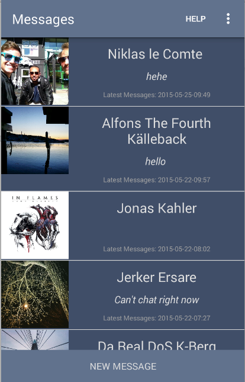
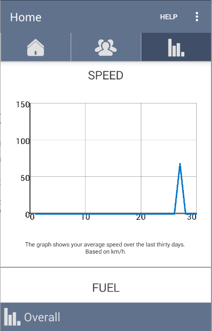

#USER MANUAL

###GENERAL INFORMATION
Trux is a community based android application for truck drivers. Trux has various features, like data collection, driver monitoring and online truck drivers community features.

#### System Overview
Trux implements two different application states depending on the status of the driver. If the driver is driving some of the features are not accessible in order to guarantee driver safety. The community features allow drivers to easily communicate and locate each other using a map feature.

### PREREQUISITES
Trux is an android application, which is designed to run on android phones. It is compatible with Android 4.2 API level 4 and higher versions. The application requires connection to internet in order to save data to database, internal GPS receiver in order to provide map features and to connect to the server. After installation on a device, Trux can be used immediately without any further configuration users are only required to create an account by registering. 

#### User Access Levels
In order to use Trux a user must register and obtain a username and password to login in to the application.    

#### Contingencies
Trux requires internet connection and in case of internet disconnection trux can not be used and data is not saved in internal memory of the operating device. 

### GETTING STARTED
Trux currently can be installed to a device by connecting the device to a computer with a USB cable and running it through Android Studio.  

#### Installation and Logging In
Since Trux is not officially launched in the Google Play store the best way of installing it on your phone is to retrieve the link from the main README, redirect to that link from your phone and the application will be installed. However, do note that you need to turn on the "Unknown Sources" setting in the security settings of your android device or the installation will be blocked.
Once the application is installed on the device, the user can use Trux. As mentioned above the user is required supply their username and password when logging in has the option to enable auto-login for future sessions.   
Trux is a tabbed application, that consists of three main tabs. The first tab is the home tab (Figure 1) and it includes two buttons, one for messages and the other for friends. The message button opens the conversation list. The friends button opens the friends list, where user can search for friends as well as follow a friend in the map if they are online. A friend who is online is indicated by a location icon which is clickable. The user can stop following a friend by clicking the map.  If the user is currently driving some, features are not accessible. To distinguish this two states the system is divided into two views, normal state and driving state. 

#### Home Page 

#### Message page 
In the normal state the user is able to chat and type messages freely.

In the driving mode the user can only choose from predefined messages.

#### Friends  page
In the friends page a user can search for people and send friend request and accept or reject any received friend request. The search and friend request features are not available while driving.

User can send a friend request by clicking the friend icon. 
User can accept or reject a friend request by clicking the green icon or the red icon.

#### Community Page  
The second tab is the community tab and it has a map, where users can see where their friends are and it contains a Profile button that takes the user to their profile as well as a Friends button that is a shortcut to the Friends list. 

In the normal mode, the user can scroll the map freely.

In the driving mode the user is only able to see the map and the friends button. The map can follow the current user or any online friend chosen from the friend list, but is locked for manual scrolling. 

The map view can be changed between Hybrid and Standard in the settings.

#### Normal Map View

#### Driving mode map view 

#### Profile Page  
The profile page is where the user can change his/her profile picture and also can edit their credentials and save the changes. 
The profile feature is only available in the normal mode, in the driving mode the user does not have access to this page. 

#### Statistics Page  
The third tab is the statistics tab (Figure 2) and it contains all the statistics in a graph format. The page also contains a tab with four options where the user can choose to open an overview page of statistics or a single view of different variables, like for fuel, distance and speed. The variables are visualized using graphs with the data collected with in the last 30 days. These are only available while not driving.

#### Fuel Graph Page

#### Speed Graph Page 

#### Distance Traveled Page 

#### Changing Password and Reporting System Issues 
The password can only be changed by contacting the developers through the Contact us page. In the contact us page the user also has an option to send feedback and report system issues. 

#### Contact Us and Logout 
User can choose from a dropdown list the issue they what to address. The issue reported is then emailed to the developers. To logout the user just needs to click the logout button from the dropdown list in the menu.  

